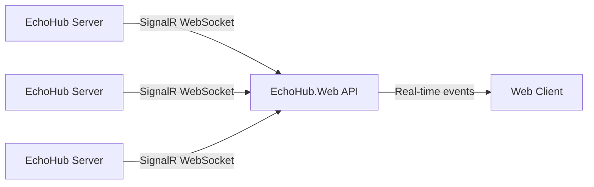

<p align="center">
  <a href="https://github.com/HueByte/EchoHub">
    
  </a>
</p>

<h1 align="center">EchoHub.Web</h1>

<p align="center">
  The landing page and live server directory for <a href="https://github.com/HueByte/EchoHub">EchoHub</a>.
</p>

<p align="center">
  <a href="#what-is-this">What</a> &bull;
  <a href="#getting-started">Setup</a> &bull;
  <a href="#configuration">Config</a> &bull;
  <a href="#project-structure">Structure</a> &bull;
  <a href="#license">License</a>
</p>

<p align="center">
  
  
  
  
  
  
</p>

---

## What is this?

A homepage and real-time server browser for the [EchoHub](https://github.com/HueByte/EchoHub) chat system.

EchoHub servers register themselves over SignalR WebSockets. The web app picks that up and shows a live server list — online status, user counts, the works. No polling, no refresh button.



### What you get

- **Live server directory** — servers appear and disappear in real time
- **SignalR integration** — EchoHub instances connect via WebSocket, broadcast status and user counts
- **Animated star field** — particle background, because why not
- **Dark minimal UI** — Grok-inspired, near-black, no clutter
- **OpenAPI codegen** — TypeScript API client generated from swagger at build time
- **Clean Architecture** — Core, App, Infrastructure separation on the backend
- **Docker Compose** — one command to run everything

## Getting Started

### Prerequisites

- [.NET 10 SDK](https://dotnet.microsoft.com/download)
- [Node.js](https://nodejs.org/) (LTS)

### Run the API

```bash
dotnet run --project src/EchoHub.Infrastructure
```

### Run the client

```bash
cd src/client
npm install
npm run dev
```

Vite proxies `/api` and `/hubs` to `localhost:5000` automatically.

### Docker Compose

```bash
docker compose up --build
```

That gives you:

- **API** on port `8080`
- **Client** (nginx) on port `80`

### Build from source

```bash
dotnet build src/EchoHub.Web.slnx
cd src/client && npm run build
```

The .NET build automatically generates `swagger.json` and the TypeScript API client via an MSBuild target.

## Configuration

### API (`appsettings.json`)

| Key                                   | Default        | Description                |
|---------------------------------------|----------------|----------------------------|
| `ConnectionStrings:DefaultConnection` | *(in-memory)*  | Database connection string |
| `Serilog:MinimumLevel:Default`        | `Information`  | Log level                  |
| `AllowedHosts`                        | `*`            | Allowed host headers       |

Copy `appsettings.example.json` to `appsettings.json` to get started.

Logging uses Serilog — console + daily rolling files.

### Client (`vite.config.ts`)

| Key                         | Default                | Description          |
|-----------------------------|------------------------|----------------------|
| `server.proxy./api.target`  | `http://localhost:5000` | API proxy target     |
| `server.proxy./hubs.target` | `http://localhost:5000` | SignalR proxy target |

## Project Structure

```text
src/
├── client/                        # React + Vite + TypeScript
│   ├── src/
│   │   ├── api/                   # REST client & SignalR connection
│   │   ├── components/            # StarField, SideMenu
│   │   └── pages/                 # Home, Servers
│   ├── nginx.conf                 # Production proxy config
│   └── Dockerfile
│
├── EchoHub.Core/                  # Domain entities & interfaces
│   ├── Entities/
│   └── Interfaces/
│
├── EchoHub.App/                   # Application services & DTOs
│   ├── DTOs/
│   ├── Interfaces/
│   └── Services/
│
├── EchoHub.Infrastructure/        # API, hubs, data access
│   ├── Controllers/
│   ├── Hubs/                      # SignalR server hub
│   ├── Data/
│   ├── Repositories/
│   └── Dockerfile
│
└── EchoHub.Web.slnx               # Solution file
```

## License

MIT — do whatever you want with it.
